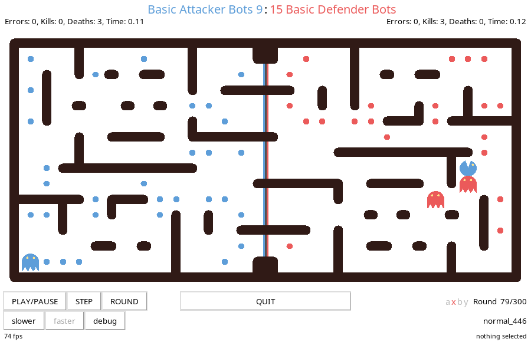
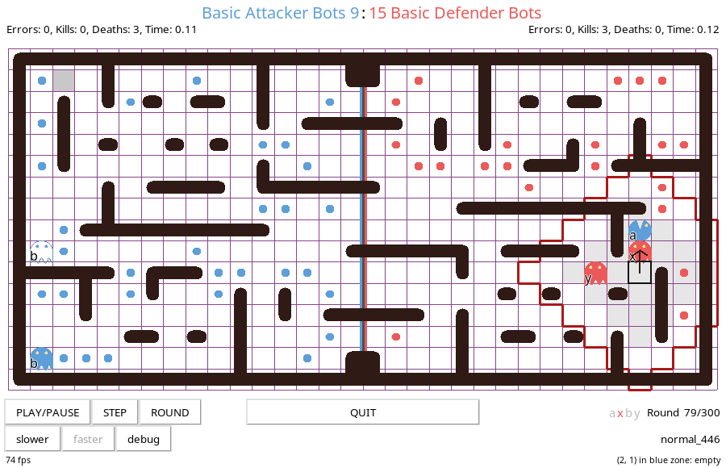

Pelita
======

## Table of contents
- [Pelita](#pelita)
  - [Table of contents](#table-of-contents)
- [Introduction](#introduction)
  - [Your task](#your-task)
  - [Content of this repository](#content-of-this-repository)
  - [Running a game](#running-a-game)
  - [The graphical interface](#the-graphical-interface)
    - [Keyboard shortcuts](#keyboard-shortcuts)
  - [Testing](#testing)
    - [Manual testing](#manual-testing)
    - [Unit testing](#unit-testing)
  - [Layouts](#layouts)
  - [Full API Description](#full-api-description)
    - [The maze](#the-maze)
    - [The `move` function](#the-move-function)
    - [The `Bot` object](#the-bot-object)
    - [Running multiple games in the background](#running-multiple-games-in-the-background)
  - [Debug using the GUI](#debug-using-the-gui)

------------------------------------------------

Introduction
============


Pelita is a Pac-Man like game. Two teams each of two characters (bots) are placed in a maze with food pellets. The blue team starts on the left of the maze, with bots named `a` and `b`. The red team starts on the right of the maze, with bots named `x` and `y`.

The maze is split into two parts, the left one belongs to the blue team, the right one belongs to the red team. When a bot is in its own homezone it is a ghost. A ghost can defend its own food pellets by killing the enemies. When a bot is in its enemy's homezone it is a pac-man and can eat the enemy's food. The game is turn-based: one bot moves, the rules of the game are applied, a new state of the game is generated, the next bot moves. The first bot of the blue team, bot `a`, moves first, then the first bot of the red team, bot `x`, moves, then the second bot, `b`, of the blue team, and finally the second bot, `y`, of the read team. This defines a round. A standard game lasts at most 300 rounds.

The rules:

- **eating food**: when a bot eats a food pellet, the food pellet is permanently removed from the maze and **one point** is scored for the bot's team.

- **killing enemies**: when a ghost kills an enemy pac-man, the killed pac-man is immediately reset to its starting position and **5 points** are scored for the ghost's team.

- **enemy positions**: a bot can know the exact position of the enemies only when the enemies are close enough. A bot as a "sight" radius of  **5** squares. When enemies are located within the sight radius the bot will know their position exactly. If the enemies are further away than that, the bot will only get an approximate position of the enemies (more details [below](#has-exact-position)).

- **food relocation**: a ghost casts a shadow of **1** square around itself. Food pellets that stay in the shadow of a ghost for more than 15 rounds without interruption are moved to a different location at random (more details [below](#shaded-food)).

- **timeouts**: each bot has **3** seconds to return a valid move. If it doesn't return in time a random legal move is executed. At the 5th timeout the team is disqualified and the game is over. 

- **illegal moves**: if a bot returns an illegal move, the team is immediately disqualified and the game is over.

- **exceptions**: if a bot raises an Exception, the team is immediately disqualified and the game is over.

- **game over**: the game ends when one team eats all of its enemy's food pellets **or** after **300** rounds **or** when a team is disqualified.

- **the winner**: the team with the highest score after game over wins the game, regardless of which team finished the food. A team also wins if the opponent team is disqualified, regardless of the score.

## Your task

Your task as a group is to write a bot implementation. You have to implement the *intelligence* to navigate your bots successfully
through the maze, kill the enemy's pac-men, and eat the enemy's food. You can find a minimal implementation in the [demo01_stopping.py](demo01_stopping.py) file:
```python
TEAM_NAME = 'StoppingBots'

def move(bot, state):
    # do not move at all
    return bot.position
```
As seen above, your implementation consists of a team name (the `TEAM_NAME` string) and a function `move`, which takes a `bot` object  (which contains all the data that you need to make your decision) and a `state` dict (which you are supposed to fill) and returns the next position for current bot. Don't panic right now, in the [Full API Description](#full-api-description) section you'll find all the details.

## Content of this repository
In this repository you will find several demo implementations (all files named `demoXX_XXX.py`), that you can use as a starting point for your own implementations. The demos build upon each other, so it will be useful to follow them in order.

The files named  `test_demoXX_XXX.py` are example unit tests for some of the demo bot implementations. You can run the tests within a clone of this repo with `pytest` by typing:
```bash
$ python -m pytest
```

In the `notebooks` folder you can find some examples of other ways of interacting with the pelita code. [notebooks/nb1_matplotlib_and_numpy.ipynb](notebooks/nb1_matplotlib_and_numpy.ipynb) shows how you might use numpy arrays and matplotlib to visualize game states. [notebooks/nb2_enemy_noise.ipynb](notebooks/nb2_enemy_noise.ipynb) uses the same approach to visualize enemy positions and approximate positions[as explained below](#has-exact-position). Notebooks can be a useful way to get an intuition for the `bot` object properties or for visualizing game statistics, but should not be used to actually write your bot.

## Running a game
- To run a demo game, just type at the command line:
    ```bash
    $ pelita
    ```
- To test a demo implementation against another one:
    ```bash
    $ pelita demo03_smartrandom.py demo05_basic_hunter.py
    ```
More info about the command `pelita` [below](#manual-testing)

## The graphical interface


Pelita’s graphical interface contains a few tools that can help with debugging. For example, using the ‘slower’ and ‘faster’ buttons, one may change the maximum speed of the game. (Of course, it is not possible to speed up slow bots using this.)

When the game has been paused, the `step` and `round` buttons will execute a single step or play a complete round. Additionally, selecting a specific square in the grid will show its coordinates and if the square is a wall or contains food or bots are sitting on it.

The `debug` button activates the [debug mode](#debug-using-the-gui).

### Keyboard shortcuts

    q               Quit
    f               Toggle fullscreen
    #               Toggle debug mode
    >               Increase speed
    <               Decrease speed
    [Space]         Play/pause
    [Enter]         Play a single step (when in pause mode)
    [Shift+Enter]   Play one round (when in pause mode)


## Testing
There are several strategies to test your bot implementations.

### Manual testing
You can test an implementation by playing against some of the demo implementations or against itself.

You can pass several options to the `pelita` command to help you with testing.

- **`--seed SEED`** you can pass the `--seed` option to the `pelita` command to repeat a game using the same random seed. The random seed for a game is printed on standard output:
    ```bash
    $ pelita demo03_smartrandom.py demo02_random.py
    Replay this game with --seed 7487886765553999309
    ᗧ blue team 'demo03_smartrandom.py' -> 'SmartRandomBots'
    ᗧ red team 'demo02_random.py' -> 'RandomBots'
    ...
    ```
    You can replay this exact game:
    ```bash
    $ pelita --seed 7487886765553999309 demo03_smartrandom.py demo02_random.py
    ...
    ```

- **`--stop-at ROUND`** you can pass the `--stop-at` option to the `pelita` command to stop a game at a specific round. You can then, for example, show the grid, play the next turns step by step, etc.

- **`--stop-after-kill`** similarly, this will stop `pelita` every time that a bot has been killed.

- **`--null`** you can pass the option `--null` to the `pelita` command to suppress the graphical interface and just let the game play in the background. This is useful if you want to play many games and just look at their outcome, for example to gather statistics. (A better strategy to play games in the background is shown in [demo10_background_games.py](demo10_background_games.py)).

- **`--ascii`** you can pass the option `--ascii` to the `pelita` command to  suppress the graphical interface and instead use a textual visualization in the terminal, which contains a lot of useful debug info.

- **`--progress`** similar to `--null` but showing the progress of the running game.

- **`--no-timeout`** you can pass the option `--no-timeout` to disable the timeout detection. Usually, if a bot takes longer than 3 seconds to respond it is considered an error. Disabling it is useful for example if you want to run a debugger on your bot, like in [demo07_debugger.py](demo07_debugger.py)

- **`--help`** the full list of supported options can be obtained by passing `--help`.

### Unit testing
You should write unit tests to test your utility functions and to test your bot implementations. It is quite hard to test a full strategy, especially because you can not have a real opponent in a test game. It is useful to focus on specific situations (called `layouts`) and verify that your bot is doing the right thing. More info about layouts in the [Layouts](#layouts) section.

Several examples for unit testing are available in this repo in the files named `test_XXX.py`. If you name your test files starting with `test_` your tests will be automatically picked up by `pytest` when you run on the console in the directory where you cloned this repo:
```bash
$ python -m pytest
```
An example unit test could look like this:
```python
from demo01_stopping import move
from pelita.utils import setup_test_game


def test_stays_there_builtin_random_layout():
    # Using a random builtin layout, verify that the bot stays on its initial position
    bot = setup_test_game(layout=None, is_blue=True)
    next_pos = move(bot, {})
    # check that we did not move
    assert next_pos == bot.position
```

The test first has to set up a game environment by using the utility function `setup_test_game` imported from the `pelita.utils` module before calling the `move` function of the loaded bot.

**`setup_test_game(layout, is_blue=True, round=None, score=None, seed=None, food=None, bots=None, is_noisy=None) ⟶ bot`**

Given a layout string, it returns a [Bot](#the-bot-object) which you can pass to the [move](#the-move-function) function.

The blue team's homezone is always on the left and the red team's homezone is always on the right. In the `setup_test_game` function you can pass `is_blue` which defines which side you are currently playing on.

The full documentation for the `setup_test_game` function can be read in its docstring:
```bash
$ python
>>> from pelita.utils import setup_test_game
>>> help(setup_test_game)
>>> ...
```


## Layouts
When you play a game using the command `pelita` without specifying a specific layout with the `--layout` option, a random layout will be generated.

When you run your own games or write tests, you may want to play a game on a fixed layout. You can save a layout generated with a specific random seed to a file:
```bash
$ pelita --seed 12345 --save-layout test_12345.layout
```
And then play on this layout:
```bash
$ pelita --layout test_12345.layout
```
You can use the saved layout in `setup_test_game` by passing the content of the file as a string:
```bash
$ python
>>> from pelita.utils import setup_test_game
>>> layout_str = open('test_12345.layout', 'rt').read()
>>> bot = setup_test_game(layout_str, ....)
```

You may also want to specify very simple layouts to test some basic features of your bot that require you to know exactly where the walls, the enemies and the food are. In this case you can pass to `setup_test_game` a manually crafted layout string. There are several examples of layout strings in the demo tests.

By inserting `print(bot)` within your `move` function, you can print the layout string corresponding to the current layout, together with other useful information. An example:
```
Basic Gatherer Bots (you) vs Basic Hunter Bots.
Playing on blue side. Current turn: 1. Bot: b. Round: 79, score: 11:15. timeouts: 0:0
################################
#     .  .   .      #    #     #
#  ##### ####  ##.  # .# # ### #
#     ..       ##   #  # #     #
#  #    .. # . ###.##  #    . .#
#  #.. ..  #. .     #. ###### ##
#. # .    .  .      #  #    b .#
# ######## # .   .  #        # #
# #    a   #  .     # ######## #
#.  .   #  #  .     x     . # .#
## ###### .#     . .#  ..   #  #
#. .    #  ##.###   #y..    #  #
#     # #  #   ##              #
# ### # #. #  .##  #### #####  #
#     #    #      .   .  .     #
################################
Bots: {'a': (7, 8), 'x': (20, 9), 'b': (28, 6), 'y': (21, 11)}
Exact: {'a': True, 'x': False, 'b': True, 'y': False}
Food: [(4, 9), (14, 13), (10, 6), (1, 6), (1, 9), (13, 11), (4, 5), (14, 9), (5, 6),
(9, 1), (8, 5), (9, 4), (13, 4), (9, 13), (13, 1), (13, 7), (1, 11), (6, 1), (7, 3),
(12, 5), (14, 5), (3, 11), (14, 8), (5, 5), (8, 4), (10, 10), (13, 6), (7, 5),
(6, 3), (7, 8), (22, 2), (22, 11), (23, 10), (22, 14), (30, 6), (30, 9), (18, 4),
(17, 2), (24, 10), (21, 5), (23, 11), (28, 4), (17, 7), (30, 4), (17, 10), (19, 10),
(25, 14), (26, 9), (18, 14)]
```

The walls are identified by `#`, the food by `.`, the bots are `a` `b` for the blue team and `x` `y` for the red team. The exact coordinates of all food pellets and of the bots (with a note about their precision). More details about bot position precision [below](#has-exact-position).

You can create smaller mazes, which are easier to test with and can be typed directly into the tests. For example a maze `8x4` with the blue bots in `(1, 1)` and `(1, 2)`, where the red bots are on `(5,2)` and `(6,2)` and food pellets in `(2, 2)` and `(6,1)`, and an additional wall in `(4,1)` will look like this:
```python
layout="""
########
#a # . #
#b.  xy#
########
"""
```
In case some objects are overlapping (for example you want to locate a red bot over a food pellet) you can pass a partial layout and specify the positions of the objects in a list of coordinates to `setup_test_game`. For example:
```python
from pelita.utils import setup_test_game

def test_print_stuff():
    layout="""
    ########
    #a # . #
    #b.  xy#
    ########
    """
    bot = setup_test_game(layout=layout, food=[(1,1), (1,2), (5,2), (6,2)])
    print(bot)
```
Save this into a file `test_test.py`. When you run this test with `python -m pytest -s test_test.py` you get:
```bash
...

test_test.py blue (you) vs red.
Playing on blue side. Current turn: 0. Bot: a. Round: None, score: 0:0. timeouts: 0:0
########
#a # . #
#b.  xy#
########
Bots: {'a': (1, 1), 'x': (5, 2), 'b': (1, 2), 'y': (6, 2)}
Exact: {'a': True, 'x': True, 'b': True, 'y': True}
Food: [(1, 1), (1, 2), (2, 2), (6, 2), (5, 1), (5, 2)]
...
```
Notice that we have to pass the option `-s` to `pytest` so that it shows what we print. By default `pytest` swallows everything that gets printed to standard output and standard error on the terminal.

## Full API Description

### The maze
The maze is a grid. Each square in the grid is defined by its coordinates. The default width of the maze is `32` squares, the default height is `16` squares. The coordinate system has the origin `(0, 0)` in the top left of the maze and its maximum value `(31, 15)` in the bottom right. Each square which is not a wall can be empty or contain a food pellet or one or more bots. The different mazes are called `layouts`. For the tournament all layouts will have the default values for width and height and will have a wall on all squares around the border.

### The `move` function
**`move(bot, state) ⟶ (x, y)`**

The `move` function gets two input arguments:

- **`bot`** is a reference to the bot in your team corresponding to the current turn. It is an instance of the [`Bot` object](#the-bot-object), which contains all information about the current state of the game

- **`state`** is a dictionary which can be used to hold information persistently over rounds. It is empty when the game starts. In the `move` function you can store whatever you want in it. Examples for the usage of the `state` dictionary can be found in [demo04_basic_gatherer.py](demo04_basic_gatherer.py), [demo05_basic_hunter.py](demo05_basic_hunter.py), [demo06_switching_bots.py](demo06_switching_bots.py):
    ```python
    def move(bot, state):
        state['something_to_remember'] = 'an important string'
        return bot.position
    ```

    The same `state` dictionary is available to both bots of a team. It will be passed untouched to the move function at every turn. Thus, if your bots want to remember distinct things, it may make sense to create a dictionary key for each bot.

    ```python
    def move(bot, state):
        state[bot.turn] = f'i am bot {bot.turn}'
        return bot.position
    ```


The `move` function returns the position to move the bot to in the current turn. The position is a tuple of two integers `(x, y)`, which are the coordinates on the game grid.

Note that the returned value must represent a legal position, i.e. it must be an adjacent position and you can not move your bot onto a wall or outside of the maze. If you return an illegal position, your team is immediately disqualified, the game is over and you lose the game.

### The `Bot` object
Note that the `Bot` object is read-only, i.e. any modifications you make to that object within the `move` function will be discarded at the next round. Use the `state` dictionary for keeping track of information between rounds.

- **`bot.turn`** is the turn this bot is playing, either `0` (for bot `a` and `x`) or `1` (for bot `b` and `y`).

- **`bot.other`** is the other bot in your team. It is a reference to a `Bot` object.

- **`bot.position`** is a tuple of the coordinates your bot is on at the moment. For example `(3, 9)`.

- **`bot.legal_positions`** is a list of positions your bot can take in the current turn without hitting a wall. At each turn the bot can move by one square in the grid, either horizontally or vertically, if the target square is not a wall. Note that the bot can always stay in the same position, i.e. you can let your `move` function return `bot.position`.

- **`bot.walls`** is a tuple of the coordinates of the walls in the maze:
    ```python
    ((0, 0), (1, 0), (2, 0), ..., (29, 15), (30, 15), (31, 15))
    ```
    so, if for example you want to test if position `(3, 9)` in the maze is a wall, you can do:
    ```python
    (3, 9) in bot.walls
    ```

    The maze is also represented as a graph in the attribute `bot.graph`.

- **`bot.graph`** is a representation of the maze as a graph. The graph represents the free squares in the maze –i.e. all the non-wall coordinates– and their connections. The `bot.graph` object is an instance of the [`Graph`](https://networkx.org/documentation/stable/reference/classes/graph.html) class from the  [networkx](https://networkx.github.io) library. `bot.graph` is immutable: an editable copy of the graph is returned by the `bot.graph.copy()` method if you need it. 

    Examples for using a graph representation for shortest path calculations using the [networkx](https://networkx.github.io) library can be found in [demo04_basic_gatherer.py](demo04_basic_gatherer.py) and [demo05_basic_hunter.py](demo05_basic_hunter.py).
 
- **`bot.shape`** is a tuple with the size of the maze. The usual maze size will be `32x16`, that is `(32, 16)`, unless other layouts are specified.

- **`bot.homezone`** is a tuple of all the coordinates of your side of the maze that are not a wall. If for example you are the red team in a `32×16` maze, your homezone might be:
    ```python
    ((16, 1), (16, 2), (16, 3), ..., (30, 11), (30, 13), (30, 14))
    ```
    as with `bot.walls` you can test if position `(3, 9)` is in your homezone with
    ```python
    (3, 9) in bot.homezone
    ```
    You can check if you got assigned the blue team – your homezone is the left side of the maze – with **`bot.is_blue`**. Otherwise you are the red team and your homezone is the right side of the maze. The blue team always plays the first move.

- **`bot.food`** is the list of the coordinates of the food pellets in your own homezone
    ```python
    [(17, 8), (24, 8), (17, 7), ...]
    ```
    as soon as the enemy starts eating your food pellets this list will shorten up!

- **`bot.shaded_food`** <a id="shaded-food"></a> a list of the food pellets currently in the shadow of one or both of the team's bots. When a bot is in its homezone it casts a shadow of **1** square around itself. Food pellets that happen to be in the shadow for **15** rounds without interruption will get relocated at the next turn. When a food pellet turns grey in the GUI it indicates that there are only 3 rounds left before being relocated. The new position of the pellets is chosen randomly within the free squares of the bot homezone, but outside of the bot's shadow and not on top of another bot. Note that **`bot.enemy[0].shaded_food`** is always empty: you cannot see which food pellets are in the shadow of the enemy.

- **`bot.track`** is a list of the coordinates of the positions that the bot has taken until now. It gets reset every time the bot gets killed by an enemy ghost.

- When you are killed, the property **`bot.was_killed`** is set to `True` until the next round.

- **`bot.score`** and **`bot.round`** tell you the score of your team and the round you are playing.

- **`bot.random`** is an instance of the Python internal pseudo-random number generator. Do not import the Python `random` module in your code, just use this for all your random operations. Example of using it are found in [demo02_random.py](demo02_random.py), [demo03_smartrandom.py](demo03_smartrandom.py), and several others. If you need to use the `numpy` random module, initialize it with a seed taken from this instance like this:
    ```python
    np.random.seed(bot.random.randint(0, 2**32-1))
    ```
    Note that you want to do it only **once** per game!

- **`bot.error_count`** is a count of the timeouts your team has collected. Remember that if you timeout 5 times you lose the game, independent of the score. A timeout occurs if your `move` function takes longer than 3 seconds to return

- **`bot.say(text)`** allows you to print `text` as a sort of speech bubble attached to your bot in the graphical user interface.

- **`bot.kills`** is the number of enemy bots your bots has killed until now.

- **`bot.deaths`** is the number of times your bot has been killed until now.

- **`bot.char`** is the character representing the bot: `a`, `b`, `x` or `y`.

- **`bot.team_time`** is the total accumulated time that your team has needed so far. This corresponds to the time shown in the graphical interface. Please note that the time does not increase during the execution of your bot’s code; it is only updated once at the beginning of a step.

- **`bot.enemy`** is a list containing the references to the two enemy bots, which are also `Bot` objects, so they have all the properties we have just seen above. So, for example the position of the first enemy bot:
    ```python
    bot.enemy[0].position
    ```
    This position may be not exact (see below the `has_exact_position` property).

- **`bot.enemy[0].food`** is the list of coordinates of the food pellets you want to eat.

- **`bot.enemy[0].team_name`** you can also inspect the enemy team name with `bot.enemy[0].team_name`.

- **`bot.enemy[0].team_time`** you can also inspect the accumulated time that the enemy has used so far.

- **`bot.enemy[0].has_exact_position`**  <a id="has-exact-position"></a> your bot has a sight-radius of 5 squares. When an enemy bot is close enough, i.e. when the enemy bot is located within the sight radius of your bot, the `bot.enemy[0].has_exact_position` attribute will be `True` and `bot.enemy[0].position` will be the exact position of the enemy bot. If instead the enemy bot is further away, `bot.enemy[0].has_exact_position` will be `False` and `bot.enemy[0].position` will be only an approximation of the real position of the enemy bot. In this case the real position of the enemy bot could be anywhere within 5 squares of `bot.enemy[0].position`.

  This is better explained by the looking at the picture below. Let's assume your bot is the red bot `y` and it is `y`'s turn to move. The sight-radius for `y` is the red area:
  - `y` will "see" the exact position of enemy bot `b`, because `b` is close to `y`: `bot.enemy[1].has_exact_position==True` and `bot.enemy[1].position` will be exact.
  - The situation is different for the other enemy bot. `a` is not within the sight-radius of `y`, so `bot.enemy[0].has_exact_position==False` and `bot.enemy[0].position` will be an approximation of the `a` real position.

    In the picture you see the blue bot `a` located on its real position. `y` will not have access to that position. Instead, when calling `bot.enemy[0].position`, `y` will get the approximate location indicated by the faint outline of bot `a` in the picture. The approximate position is chosen at random among the legal positions within 5 squares of the exact one.

  An example of using the `has_exact_position` property is given in [demo05_basic_hunter.py](demo05_basic_hunter.py).

    

### Running multiple games in the background
You may want to run multiple games in the background to gather statistics about your implementation,
or to fit some parameters of your implementation. The script [demo08_background_games.py](demo08_background_games.py) is an example of this. You can run it like this:
```bash
python demo08_background_games.py
```

## Debug using the GUI
When you push the `debug` button in the GUI you'll see a lot more info. You can see:

- the grid  of squares in the maze
- the move that the current bot has just made is denoted by an highlighted square with an arrow
- the "sight radius" of the current bot, i.e. the squares around the current bot where the position of the enemy is known exactly
- the "shadow" of the current bot, i.e. the squares defining the "food" shadow of the current bot: the food pellets in the shadow will turn grey 3 rounds before they getting relocated 
- if the enemies are not close, you will see the silhouette of the enemy at `bot.enemy[X].position` in addition to the real position, which you have no access to from your code


